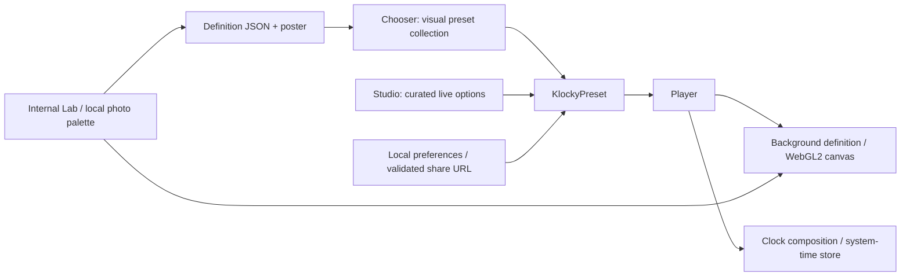

# Product and rendering architecture

The clock and shader have independent schedulers. React reads a shared system Date at real second boundaries; the browser interpolates supported hand motion. A single canvas runs outside React's frame cycle, stops while hidden, and freezes for reduced motion. The renderer disposes observers, event listeners, shaders, programs, buffers and its context on exit.

Static posters are captured from the same shader implementation. They serve collection cards, reduced-capability environments and context-loss fallback. Selection uses the View Transition API with a clipped expansion fallback. Shader changes retain the previous frame while the next program starts.

The consumer editor constrains composition. The Lab owns extensive parameters. A BackgroundDefinition's `algorithm`/`fragmentShader` key resolves to an original shader body in the shared library. Common uniforms provide palette, resolution, motion, seed, grain and transformation controls. Importing a Lab definition never evaluates arbitrary downloaded code.

Storage sanitizes IDs, hex colors, enum values, numeric ranges, time zones and locales. A copied link intentionally omits weather location and global preferences. Only explicit weather actions initiate geocoding/location requests. Service-worker caching is limited to the built app's first-party files.
